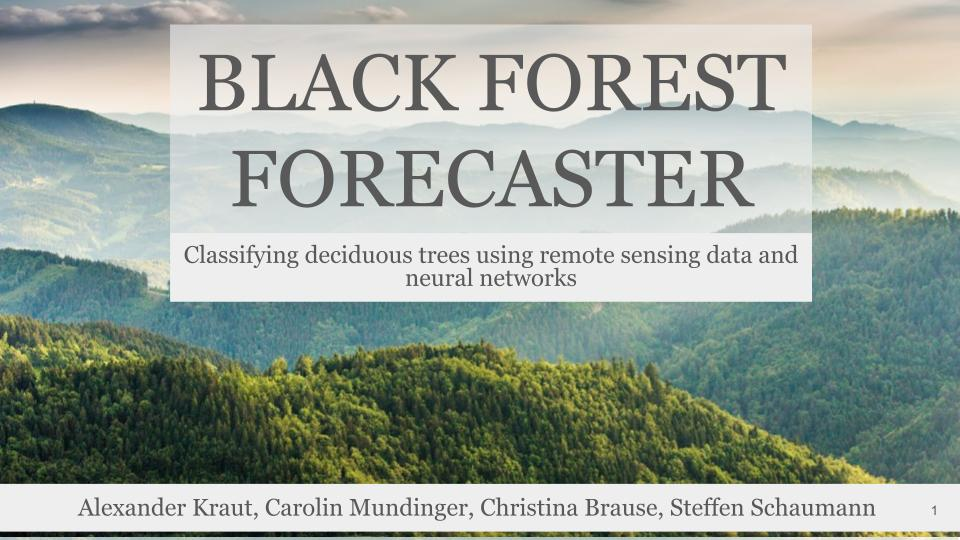

# Capstone Project: Black Forest Forecasters
<p align = "center"> 

This repository is associated with a four weeks long project, the so called "**Capstone Project**", that crowns our data science bootcamp 2023 (May to August) at [*neufische GmbH*](https://www.neuefische.de/). 

## Project Overview

As our forests' health is steadily declining, cost-efficient ways to monitor individual trees are more important than ever. To contribute to this notion, we have created a data product that uses aerial photographs (RGB and IR spectra, orthophotos), laser scanning data (LiDAR) as well as several geophysical parameters (altitude and slope) to (1) automatically extract image information for each individual tree which is then used to (2) classify its tree species using an image classification model. As convolutional neural networks (CNNs) are especially suited to classify image data, we have trained our own model with the data of around 1700 labeled trees that were provided to us by the black forest national park. Here, we focused on the classification of beeches, maples and birches while all other tree species were gathered in an "other" category.

To train our convolutional neural network, we first extracted image data around the coordinates of each pre-labeled tree and stored this information in an `.npz` file. Afterwards, all images were (1) normalized, (2) augmented through flips and 90° rotations and (3) oversampled to account for the imbalance of tree species in the dataset. While beeches occured the most (56%), followed by "other" tree species (24%), maples (15%) and birches (6%) occured less often. In addition, tree species labels were one-hot encoded.

To esimate the quality of our model, we defined a baseline model that only used the strategy of a majority vote and hence would predict the tree species correctly in 55% of all cases as there are 55% beeches in our dataset. For our more sophisticated models, we have used an ensemble of convolutional neural networks that were fed with different kinds of image information (RGB and IR information, vegetation height and densitiy of laser returns) and are then combined by shared dense layers. Additional geophysical parameters (altitude and slope) were directly fed into these shared dense layers.

Our best model classified tree species correctly in 60 to 70% of all cases. While beeches were predicted correctly in 75% of all cases, maples and birches were only predicted correctly in 20 and 50% of all cases. As these low classification results are mainly due to missclassifications of these trees as belonging to the "other" tree species category, we see the main shortcoming of our model in the low number of images that we have for each tree species which likely does not allow or neural network to create very stable representations for each tree species.

## Setup
This project was created in Python `3.11.3`. To create an environment you can run the following code in your terminal. Or install the needed libraries and dependencies from the [requirements.txt-file](./requirements.txt).
```zsh
pyenv local 3.11.3
python -m venv .venv
source .venv/bin/activate
pip install --upgrade pip
pip install -r requirements.txt
```
**Note:** The data that was used is not included in this repo.
